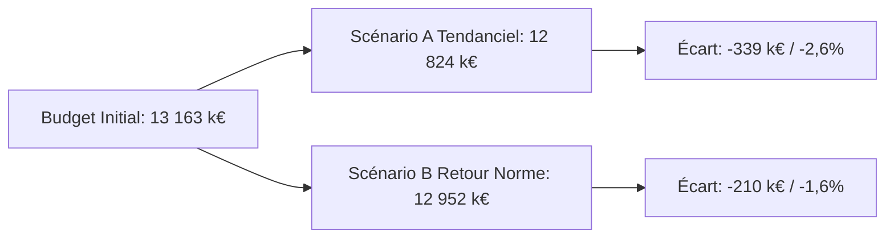

# Commentaire de Gestion — Direction Financière & Comité de Direction

**Période d'analyse :** Clôture Mensuelle — Août 2025 (Cumul 8 Mois & Projection Fin d'Année)
**Auteur :** Fofana Abdou — Contrôle de Gestion & Financial Data Analytics
**Objet :** Analyse des écarts budget vs réalisé, décomposition mix/volume/prix et arbitrages stratégiques

> Tous les chiffres de cette note sont issus directement du classeur `excel/Pilotage_Budgetaire_Retail_v2.xlsx` (onglets 2 à 5) et reconstituables depuis `data/donnees_budget_realise_retail.csv`. Chaque total ci-dessous boucle avec la somme de ses composantes.

---

### 1. Synthèse

Le Chiffre d'Affaires cumulé à fin août s'établit à **7 963 k€**, soit un **écart défavorable de -2,6 % (-210 k€)** par rapport au budget cumulé (8 174 k€). La décomposition révèle que cet écart provient à **74 % de l'effet volume (-155 k€)**, porté principalement par Mode & Textile (-88 k€, -5,7 % de volume), partiellement compensé au niveau de la marge par un **effet mix favorable de +29 k€** (repli plus marqué des catégories à faible marge unitaire). L'atterrissage annuel (Rolling Forecast) est projeté entre **12 824 k€ (Scénario A, tendanciel, -2,6 %)** et **12 952 k€ (Scénario B, retour à la norme, -1,6 %)**, contre un budget initial de **13 163 k€**.

---

### 2. Faits Marquants de la Période

* **Mode & Textile, principal contributeur défavorable :** volume en retrait de **-5,7 %** (-88 k€ de CA, -53 k€ de marge), le plus gros écart individuel du portefeuille.
* **Tension sur le coût d'achat Électronique :** coût d'achat unitaire réel en hausse de **+2,35 %** (175,0 € → 179,1 €), soit -38 k€ de marge — le plus gros écart de coût d'achat du portefeuille, devant Maison & Déco (-17 k€) et Sport & Loisirs (-15 k€).
* **Beauté & Santé également en repli de volume (-3,7 %, -50 k€ de CA)**, mais son poids dans le mix limite l'impact sur le résultat consolidé.
* **Effet mix favorable (+29 k€ sur la marge) :** le recul de volume touche davantage les catégories à marge unitaire plus faible (Mode & Textile : 27 €/unité budgétés) que les catégories à marge élevée (Électronique : 75 €/unité, Sport & Loisirs : 50 €/unité), ce qui atténue mécaniquement le choc de volume sur le résultat.
* **Dérive modérée du délai clients (DSO) :** 26,4 jours contre une référence interne de 25 jours (+1,4 jour), sans dérive du délai fournisseurs (DPO stable à 45,6 jours).

---

### 3. Analyse des Écarts Significatifs

> **Seuil de matérialité retenu :** tout écart, favorable ou défavorable, supérieur à **± 5 %** en volume/prix ou **> 10 k€** sur la marge est soumis à commentaire systématique.

#### Décomposition de l'écart de marge à fin août (en k€) :

| Composante | Montant | Lecture |
|---|---|---|
| Écart de Volume Pur | **-124 k€** | Effet mécanique de la baisse de volume totale, au taux de marge budgété moyen |
| Effet de Mix | **+29 k€** | Le mix réel s'est déplacé vers des catégories à marge unitaire plus élevée que prévu |
| Écart Prix de Vente | **-55 k€** | Concentré sur Électronique (-29 k€) et Mode & Textile (-16 k€) |
| Écart Coût d'Achat | **-88 k€** | Inflation fournisseurs généralisée (+1,5 à +2,4 % selon catégories) |
| **Total écart de marge** | **-238 k€** | *(-124 + 29 - 55 - 88 = -238, contrôle vérifié)* |

#### Tableau d'Action des Écarts Significatifs :

| Constat | Cause | Impact | Action recommandée | Pilote | Échéance |
| :--- | :--- | :--- | :--- | :--- | :--- |
| **Volume Mode & Textile -5,7 %** (-88 k€ CA / -53 k€ marge) | Repli de la demande sur la collection été, gamme à réviser | -53 k€ de marge brute | Déstockage ciblé et réallocation d'une partie du linéaire vers Sport & Loisirs (catégorie conforme au budget) | Directeur Commercial | 30 septembre 2025 |
| **Coût d'achat Électronique +2,35 %** | Inflation composants / coût fret fournisseur | -38 k€ de marge brute | Renégociation du contrat-cadre fournisseur pour le prochain trimestre | Responsable Achats | 15 octobre 2025 |
| **Volume Beauté & Santé -3,7 %** (-50 k€ CA / -35 k€ marge) | Ralentissement ponctuel, prix de vente maintenu | -35 k€ de marge brute | Suivi rapproché sans action corrective immédiate (catégorie historiquement porteuse au T4) | Responsable Catégorie | Suivi mensuel |
| **Effet mix favorable +29 k€** | Recul plus marqué des catégories à faible marge unitaire | +29 k€ de marge brute | Renforcer l'allocation marketing sur Électronique et Sport & Loisirs pour le T4 afin de consolider cet effet | Responsable Marketing | 15 octobre 2025 |

---

### 4. Atterrissage et Risques (Rolling Forecast Fin d'Année)

Le budget initial annuel est fixé à **13 163 k€**. Le taux de réalisation constaté à fin août est de **97,4 %** (réalisé cumulé 7 963 k€ / budget cumulé 8 174 k€ sur les 8 mois écoulés). Deux scénarios de projection sur les 4 mois restants sont soumis à arbitrage :

* **Scénario A (Tendanciel) :** le taux de réalisation constaté sur les 8 premiers mois (97,4 %) est maintenu sur les 4 mois restants.
  * **CA annuel projeté :** 12 824 k€ (écart : -339 k€ / -2,6 %).
* **Scénario B (Retour à la norme) :** réalisation à 100 % du budget initial sur les 4 mois restants (hypothèse de correction via le plan de déstockage et le T4 commercial).
  * **CA annuel projeté :** 12 952 k€ (écart : -210 k€ / -1,6 %).

*Ces deux scénarios portent uniquement sur le Chiffre d'Affaires ; le modèle ne projette pas mécaniquement le résultat analytique sur les mois restants, faute d'hypothèse documentée sur l'évolution des coûts fixes et variables au T4.*

---

### 5. Points d'Attention (Cash & BFR, vision structurelle à 8 mois)

1. **Dérive du DSO :** 26,4 jours contre une référence interne de 25 jours (+1,4 jour) — à surveiller, sans caractère alarmant à ce stade.
2. **Rotation des stocks :** rotation annualisée (extrapolée sur le rythme des 8 premiers mois) de **9,0 fois/an**, soit une durée moyenne de stockage de **~41 jours**. Stock moyen consolidé de **712 k€**, pour un coût de possession annualisé de **142 k€/an** (taux retenu : 20 %).
3. **BFR net :** **789 k€** (stock moyen + créances clients moyennes - dettes fournisseurs moyennes).
4. **Levier opérationnel :** **1,21** sur les 8 premiers mois — une variation de +1 % du CA se traduit par environ +1,2 % de variation du résultat analytique, et inversement.

---

### 6. Recommandations Décisionnelles

1. **Déstockage ciblé Mode & Textile :** engager une opération de déstockage progressif pour limiter l'aggravation du volume sur cette catégorie avant le pic saisonnier de fin d'année.
2. **Renégociation fournisseurs Électronique :** ouvrir la renégociation du contrat-cadre avant la fin du T3 pour limiter la poursuite de l'inflation du coût d'achat (+2,35 % constatés à date).
3. **Capitaliser sur l'effet mix favorable :** orienter les budgets marketing du T4 vers les catégories à marge unitaire élevée (Électronique, Sport & Loisirs) pour consolider l'effet mix positif de +29 k€ déjà observé.
